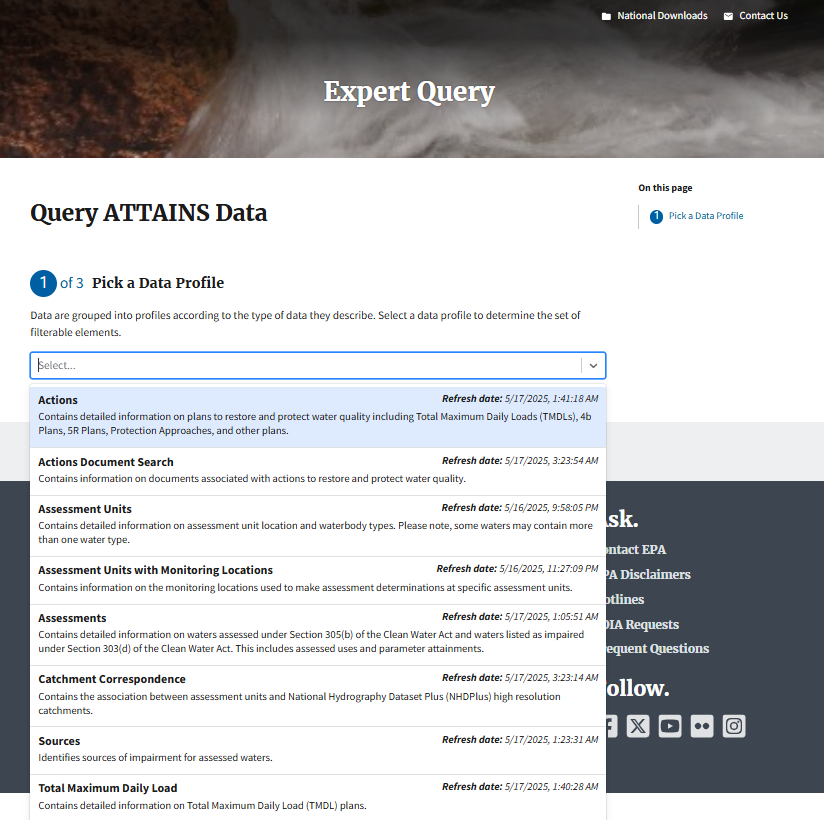
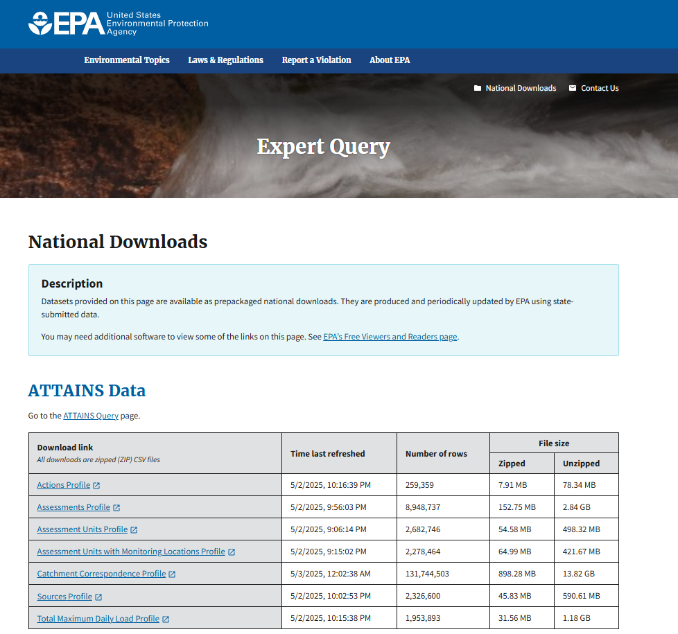

```{r setup, include = FALSE}
library(knitr)
```

```{css, echo = F, eval = FALSE}
pre {
  max-height: auto;
  overflow-y: auto;
}

pre[class] {
  max-height: auto;
}
```

## About Expert Query and rExpertQuery

[Expert Query](https://owapps.epa.gov/expertquery/attains/tmdl) empowers
users to access surface water quality data from the [Assessment and TMDL
Tracking and Implementation System
(ATTAINS)](https://www.epa.gov/waterdata/upload-data-resources-registered-attains-usershttps://www.epa.gov/waterdata/upload-data-resources-registered-attains-users)
encompassing Assessment decisions (under Clean Water Act Sections
303(d), 305(b), and 106) and Action data like Total Maximum Daily Loads
(TMDLs), Advance Restoration Plans (ARPs), and Protection Approaches.

The tool supports querying and downloading data within and across
organizations (states or tribes), such as querying all the data within
an EPA region or all nutrient TMDLs nationally. It also allows users to
download national ATTAINS data extracts.

rExpertQuery takes this a step further as its functions facilitate
querying the Expert Query web services and importing the resulting data
sets directly in to R for more detailed review and analysis.

It is crucial to be aware of certain complexities inherent in the data
and querying process. Users are cautioned against direct comparisons
between states due to differences in water quality standards and
assessment methodologies.

While Expert Query facilitates data querying, it lacks built-in summary
capabilities. Users are encouraged to download and summarize data, but
use caution when relying on row counts, as duplicate entries may occur.
This complexity arises from multiple tables that have many-to-many
relationships. Several examples of summarizing Expert Query data are
included in this vignette. These examples use additional packages for
data wrangling, mapping, visualizing and other tasks. Future
rExpertQuery vignettes and functions may provide additional examples of
how to summarize Expert Query data.

## Installation

You must first have R and R Studio installed to use the rExpert Query
(see instructions below if needed). rExpert Query is in active
development, therefore we highly recommend that you update it and all of
its dependency libraries each time you use the package.

You can install and/or update the [rExpertQuery
Package](https://github.com/USEPA/rExpertQuery) and all dependencies by
running:

```{r install, eval = TRUE, echo = TRUE, results = 'hide', message = FALSE, warning = FALSE}

# install and load rExpertQuery
if (!"remotes" %in% installed.packages()) {
  install.packages("remotes")
}

remotes::install_github("USEPA/rExpertQuery", ref = "training", dependencies = TRUE, force = TRUE)

library(rExpertQuery)
```

This vignette also requires additional packages which can be installed
using the code chunk below:

```{r add.pkgs}
# list of additional required packages
demo.pkgs <- c("data.table", "dplyr", "DT", "ggplot2", "maps", "plotly", "usdata", "usmap", "stringi")

# install additional packages not yet installed
installed_packages <- demo.pkgs %in% rownames(installed.packages())
if (any(installed_packages == FALSE)) {
  install.packages(packages[!installed_packages])
}

# load additional packages for this vignette
library(data.table)
library(dplyr)
library(DT)
library(ggplot2)
library(maps)
library(plotly)
library(usdata)
library(usmap)
library(stringi)
```

As a final setup step, we will turn off scientific notation so that any
catchment id numbers from our queries are displayed correctly.

```{r sci.not}
# turn off scientific notation (for catchment ids)
options(scipen = 999)
```

## API Key

Most of the rExpertQuery functions require an API key. Users can obtain
their own by using Expert Query's [API Key Signup
Form](https://owapps.epa.gov/expertquery/api-key-signup){.uri}.


To run this vignette, we can use the following test key. However, users
should obtain their own API key if they will be using rExpertQuery to
develop their own workflows.

```{r testkey, include=FALSE}
testkey <- "53BVce47MQ3KXKibjx35g4ojaDQGh8qWfbdO8cE0"
```

## rExpert Query Functions

There are ten exported functions in rExpertQuery. The first eight allow
users to query ATTAINS data via [Expert Query web
services](https://owapps.epa.gov/expertquery/api-documentation). These
are:

1)  [EQ_Actions()](https://usepa.github.io/rExpertQuery/reference/EQ_Actions.html) -
    queries and returns ATTAINS actions data
2)  [EQ_ActionsDocuments()](https://usepa.github.io/rExpertQuery/reference/EQ_ActionsDocuments.html) -
    queries and returns ATTAINS Actions Documents, including a keyword
    search
3)  [EQ_Assessments()](https://usepa.github.io/rExpertQuery/reference/EQ_Assessments.html) -
    queries and returns ATTAINS Assessments (default is for latest
    cycle)
4)  [EQ_AssessmentUnits()](https://usepa.github.io/rExpertQuery/reference/EQ_AssessmentUnits.html) -
    queries and returns ATTAINS Assessment Units (default is for Active
    AUs)
5)  [EQ_AUsMLs()](https://usepa.github.io/rExpertQuery/reference/EQ_AUsMLs.html) -
    queries and returns ATTAINS Assessment Units with Monitoring
    Location data
6)  [EQ_CatchCorr()](https://usepa.github.io/rExpertQuery/reference/EQ_CatchCorr.html) -
    queries and returns ATTAINS Catchment Correspondence data (memory
    intensive)
7)  [EQ_Sources()](https://usepa.github.io/rExpertQuery/reference/EQ_Sources.html) -
    queries and returns ATTAINS Sources data
8)  [EQ_TMDLs()](https://usepa.github.io/rExpertQuery/reference/EQ_TMDLs.html) -
    queries and returns ATTAINS TMDL data

These first eight functions are analogous to the data profiles that can
be queries through the [Expert Query User
Interface](https://owapps.epa.gov/expertquery/attains/).



An additional function allows users to download the [Expert Query
National
Extracts](https://owapps.epa.gov/expertquery/national-downloads){.uri}
of ATTAINS data which are updated weekly. This function should be used
when national data are desired or when a query designed in one of the
previous eight functions would exceed the Expert Query web services
limit of one millions rows. This function is:

9)  [EQ_NationalExtract()](https://usepa.github.io/rExpertQuery/reference/EQ_NationalExtract.html) -
    returns national extract for Actions, Assessments, Assessment Units,
    Assessment Units with Monitoring Locations, Catchment
    Correspondence, Sources, or TMDLS based on user selection

The tenth function relies on [ATTAINS web
services](https://www.epa.gov/waterdata/how-access-and-use-attains-web-services)
to provide allowable domain values for some rExpertQuery parameters:

10) [EQ_DomainValues()](https://usepa.github.io/rExpertQuery/reference/EQ_DomainValues.html) -
    returns domain values for some rExpertQuery function params

## Demo Structure

In this session, we will use rExpertQuery functions, along with some
common R packages for data wrangling and visualization to answer some
commonly asked questions with Expert Query data. Members of the ATTAINS
team will be monitoring the chat for questions. If there are many
questions regarding a particular function, we may pause at the end of
that function's material to review. Otherwise, questions are welcome at
the end of the demo as time permits or via e-mailing the ATTAINS team at
attains\@epa.gov.

## EQ_NationalExtract

[**EQ_NationalExtract()**](https://usepa.github.io/rExpertQuery/reference/EQ_NationalExtract.html)provides
an efficient method for importing the [Expert Query National
Extracts](https://owapps.epa.gov/expertquery/national-downloads). This
function requires one argument, "extract" to specify which of the
National Extracts to download. The following examples show how to
download the TMDL and Actions extracts. The extracts are all large files
and some may not open in R if there is not enough memory available.



1.  **What is the most commonly reported impairment nationally?**

    After downloading the national assessments data, we'll need to
    filter to include only the latest cycle. Next, we can filter for
    rows containing parameter causes, and summarize how many times each
    parameter was listed as a cause of impairment. The additional
    packages used to answer this question are
    [dplyr](https://dplyr.tidyverse.org/) (data manipulation) and
    [DT](https://rstudio.github.io/DT/) (interface to DataTables
    library).

    ```{r common.impairment}
    # import natioanl assessments profile
    assessments.nat <- rExpertQuery::EQ_NationalExtract("assessments")

    # filter for latest assessments
    assessments.nat <- assessments.nat %>%
       dplyr::group_by(organizationId) %>%
        dplyr::slice_max(reportingCycle) %>%
        dplyr::select(-objectId) %>%
        dplyr::distinct() %>%
        dplyr::ungroup()

    # count impairments
    count.impair <- assessments.nat %>%
      # filter to retain only parameter causes
      dplyr::filter(parameterStatus == "Cause") %>%
      # subset data to find unique combinations
      dplyr::select(organizationId, assessmentUnitId, parameterName) %>%
      # remove duplicates
      dplyr::distinct() %>%
      # group by parameterName
      dplyr::group_by(parameterName) %>%
      # count listings for each parameterName
      dplyr::summarise(count = length(assessmentUnitId)) %>%
      # arrane in descending order
      dplyr::arrange(desc(count))

    # create data table of impairment count results
    DT::datatable(count.impair, options = list(pageLength = 10, scrollX = TRUE))
    ```

<!-- -->

2.  **Which waters are impaired for SELENIUM nationally? Which states
    contain waters impaired for SELENIUM?**

    Again, we'll use the national assessments data filtered to the
    latest cycle. We we will then filter for rows where the parameter is
    both selenium and listed as a cause. The additional packages used in
    this step are [dplyr](https://dplyr.tidyverse.org/) and
    [DT](https://rstudio.github.io/DT/).

    ```{r param.nat}

    # filter assessments data set for 
    param.nat <- assessments.nat %>% 
      # filter for selenium and cause
      dplyr::filter(parameterName == "SELENIUM" &
                      parameterStatus == "Cause")

    # data table of selenium impairments
    DT::datatable(param.nat, options = list(pageLength = 10, scrollX = TRUE))

    ```

    Then we can create a list of states that have at least one selenium
    impairment listed. We can also visualize this information on a map,
    with states containing selenium impairments filled in blue. To build
    this map, we first create a data frame with all 50 states and a
    "SeleniumImpairment" column populated with "yes" or "no" to indicate
    whether it has any listed selenium impairments.

    In addition to [dplyr](https://dplyr.tidyverse.org/), this code
    chunk also uses
    [usdata](https://openintrostat.github.io/usdata/index.html) (US
    demographic data),
    [datasets](https://stat.ethz.ch/R-manual/R-devel/library/datasets/html/00Index.html)
    (collection of data sets for use in R), [usmap](https://usmap.dev/)
    (US choropleth plotting) and
    [ggplot2](https://ggplot2.tidyverse.org/) (creating graphics).

    ```{r param.map}
    # filter to create df of states that have at least one selenium impairment}
    state.names.sel <- param.nat %>%
      # select state column from filtered df
      dplyr::select(state) %>%
      # retain only distinct values for state
      dplyr::distinct() %>%
      # change state abbreviation to full state name
      dplyr::mutate(state = usdata::abbr2state(state)) %>%
      # create a list from the df
      dplyr::pull()

    # read in a list of all 50 state  names
    state.names <- datasets::state.name

    # create df with of all 50 state names
    sel.map.data <- as.data.frame(state.names) %>%
      # rename state.name column to state
      dplyr::rename(state = state.names) %>%
      # create additional column to indicate if state has recorded selenium impairments ("yes") or not ("no")
      dplyr::mutate(SeleniumImpairment = factor(ifelse(state %in% state.names.sel,
                                                "yes", "no")))

    # create map, specifying data and values
    usmap::plot_usmap(
      regions = "state", data = sel.map.data,
      values = "SeleniumImpairment", color = "black"
    ) +
    # fill states with selenium impairments with blue
      ggplot2::scale_fill_manual(
        values = c(`no` = "white", `yes` = "blue")
      ) +
    # remove legend
      ggplot2::theme(legend.position = "none")
    ```

    In the map above, the stats with selenium impairments are blue.

3.  **Which waters have a TMDL and are fully supporting nationally?**

    Starting with the filtered data frame of latest cycle assessments,
    we can filter for Fully Supporting waters with an
    asssociatedActionType of "TMDL". Again, we can use a combination of
    [dplyr](https://dplyr.tidyverse.org/) and
    [DT](https://rstudio.github.io/DT/), for data manipulation and
    creating a data table, respectively.

    ```{r tmdl.fs}

    # filter national assessments to includ only Fully Supporting w/ TMDL
    tmdl.fs <- assessments.nat %>%
      dplyr::filter(overallStatus == "Fully Supporting",
                    associatedActionType == "TMDL"
                    ) %>%
      # select columns to review
      dplyr::select(organizationId, state, assessmentUnitId, assessmentUnitName, 
                    associatedActionId) %>%
      # group by state and assessmentUnit
      dplyr::group_by(state, assessmentUnitId, assessmentUnitName) %>%
      # create column continaing all actionIds associated with the assessmentUnit
      dplyr::mutate(associatedActionIds = paste(unique(associatedActionId), 
                                                collapse = ", ")) %>%
      # remove original associatedActionId column
      dplyr::select(-associatedActionId) %>%
      # retain only distinct rows
      dplyr::distinct()

    # fully supporting waters with tmdls data table
    DT::datatable(tmdl.fs, options = list(pageLength = 10, scrollX = TRUE))
    ```

4.  **What are the impaired waters (cat 4 and 5 nationally)?**

    The workflow here is similar to the previous question, relying on
    [dplyr](https://dplyr.tidyverse.org/) and
    [DT](https://rstudio.github.io/DT/). This time we are retaining a
    few more columns for inclusion in the data table and are filtering
    by epaIRCategory for category 4 and 5 waters.

    ```{r impaired.waters}

    # select subset of columns to include
    imp.waters <- assessments.nat %>%
      dplyr::select(organizationId, organizationName, organizationType, assessmentUnitId, assessmentUnitName, assessmentDate, epaIrCategory, waterType, waterSize, waterSizeUnits) %>%
      # retain only distinct rows
      dplyr::distinct() %>%
      # filter for category 4 and 5 waters
      dplyr::filter(epaIrCategory %in% c("4", "5"))
    ```

    The resulting data frame is large, with `r nrow(imp.waters)` unique
    impaired waters nationally. Due to its size, we'll include a random
    subset of 250 results in a data table to review during the demo. You
    can view the full results by viewing the imp.waters df.

    ```{r imp.dt}

    # data table with random 250 impaired waters
    DT::datatable(imp.waters %>%
                    dplyr::slice_sample(n = 250), 
                  options = list(pageLength = 10, scrollX = TRUE))

    ```

5.  **Which organizations have included any information about
    monitoringLocations in ATTAINS? Which of these organizations have
    included any monitoringLocationDataLinks?**

    To answer this question, we'll need to import a new national
    extract. As we are curious about monitoringLocations and
    monitoringLocationDataLinks, we will want to start with the
    Assessment Units with Monitoring Locations data set. The param value
    for this in EQ_NationalExtract is "au_mls". Additional packages
    needed are [dplyr](https://dplyr.tidyverse.org/) and
    [DT](https://rstudio.github.io/DT/). We'll use some additional
    options in [DT](https://rstudio.github.io/DT/) to highlight useful
    rows in the final data table.

    ```{r nat.ausmls}
    # import national extract for assessment units/monitoring locations
    nat.ausmls <- rExpertQuery::EQ_NationalExtract("au_mls")
    ```

The next step is to filter the data frame and retain only rows that
contain a value for monitoringLocationId. The resulting data frame,
called "filtered.mls" will allow us to determine (1) which organizations
have included monitoringLocationIdentifiers and (2) which organizations
have included monitoringLocationDataLinks.

To find the organizations with monitoringLocationIdentifiers, we will
select only the rows organizationId, organizationName, and
organizationType and retain the unique rows.

To find the organizations with monitoringLocationIdentifiers, we will
apply an additional filter and keep only rows that have a value in the
monitoringLocationDataLink column. Then select only the rows
organizationId, organizationName, and organizationType and retain the
unique rows.

```{r filt.ausmls}
# filter for rows that contain monitoringLocationIds
filtered.mls <- nat.ausmls %>%
  dplyr::filter(monitoringLocationId != "",
                !is.na(monitoringLocationId))

# start with data set filtered to include only rows with MonitoringLocationIds
orgs.mls <- filtered.mls %>%
  # select columns to describe orgs
  dplyr::select(organizationId, organizationName, organizationType) %>%
  dplyr::distinct()


# start with data set filtered to include only rows with MonitoringLocationIds
links.mls <- filtered.mls %>%
  # filter for orgs with monitoringLocationDataLinks
  dplyr::filter(monitoringLocationDataLink != "",
                !is.na(monitoringLocationDataLink)) %>%
  # select columns to describe orgs
  dplyr::select(organizationId, organizationName, organizationType) %>%
  # retain distinct rows
  dplyr::distinct()
  

```

There are `r nrow(orgs.mls)` with monitoringLocationId data in ATTAINS.
Of these organizations, `r nrow(links.mls)` also contain
monitoringLocationDataLinks. We can create a data table to display this
information and apply some conditional formatting to highlight the
organizations with monitoringLocationIdentifiers in blue and those with
monitoringLocationIdentifiers and monitoringLocationDataLinks in orange.

```{r ml.map}

# create data frame summarizing which organizations have monitoringLocationIds and monitoringLocationDataLinks in ATTAINS
ml.table <- nat.ausmls %>%
  # create df of all orgs
  dplyr::select(organizationId, organizationName, organizationType) %>%
  # retain only distinct rows
  dplyr::distinct() %>%
  # add columns indicating whether the org has any data in ATTAINS for monitoringLocationId and monitoringLocationDataLink
  dplyr::mutate(monitoringLocationId = ifelse(organizationId %in% 
                                                orgs.mls$organizationId,
                                              "yes", "no"),
                monitoringLocationDataLink = ifelse(organizationId %in%
                                                      links.mls$organizationId,
                                                    "yes", "no"))
# create data table 
DT::datatable(ml.table, options = list(pageLength = 10, scrollX = TRUE)) %>% 
  # highlight rows for orgs that have monitoringLocationId in blue
  DT::formatStyle(
  "monitoringLocationId", target = "row", 
  backgroundColor = styleEqual(c("yes"), c("#66c3c5"))) %>%
  # highlight rows for orgs that also have data for data links in organge
  DT::formatStyle(
  "monitoringLocationDataLink", target = "row", 
  backgroundColor = styleEqual(c("yes"), c("#f9b97d")))

```

## EQ_Assessments

[**EQ_Assessments()**](https://usepa.github.io/rExpertQuery/reference/EQ_Assessments.html)queries
ATTAINS Assessments data. For many use cases, querying Assessments for a
single organization or state is desirable. The next example shows how to
query by a single state for the latest cycle. The default for the
function is to query for the latest cycle. If you would like to search
for an older cycle, you can set the "report_cycle" parameter equal to
the desired cycle year in YYYY format.

1.  **How many stream miles in Kansas are impaired for primary contact
    recreation in the latest cycle?**

    ```{r stream.ks}

    # set up query to search assessments for KS, primary contact recreation use, and stream
    ks.imp.streams <- rExpertQuery::EQ_Assessments(statecode = "KS",
                                                   use_name = "Primary Contact Recreation", 
                                                   api_key = testkey,
                                                   water_type = "STREAM")

    # calculate total water size
    ks.miles <- ks.imp.streams %>%
      # select required columns
      dplyr::select(assessmentUnitId, assessmentUnitName, 
                    waterSize, waterSizeUnits) %>%
      # retain distinct rows
      dplyr::distinct() %>%
      # sum water size
      dplyr::summarize(totalWaterSize = sum(waterSize)) %>%
      dplyr::pull()

    ```

    There are
    `r formatC(ks.miles, big.mark = ",", digits = 2, format = "f")`
    stream miles in Kansas impaired for primary contract recreation use.

2.  **What waters in Montana are impaired due to Zinc? How many
    different uses are zinc impairments associated with in Montana?**

    ```{r MT.impair}

    # query MT's latest assessments for zinc as a cause
    MT.impair <- rExpertQuery::EQ_Assessments(statecode = "MT",
                                              api_key = testkey,
                                              param_name = "ZINC",
                                              param_status = "Cause"
                                              )

    # summarize by useName
    MT.impair.use <- MT.impair %>% 
      dplyr::group_by(useName) %>%
      dplyr::summarize(count = length(assessmentUnitId))


    plotly::plot_ly(data = MT.impair.use,
      x = ~useName,
      y = ~count,
      type = "bar"
    )

    ```

    There are `r nrow(MT.impair.use)` uses with zinc as a cause in
    Montana:
    `r stringi::stri_replace_last(paste(MT.impair.use$useName, collapse = ", "), ", and ", fixed = ", ")`
    .

3.  **Which waters are new to category 5 in the latest cycle for
    Illinois? Which categories did they move from?**

    ```{r il.5.comp}

    # get cat 5 waters from latest assessment cycle
    IL.latest <- rExpertQuery::EQ_Assessments(statecode = "IL",
                                epa_ir_cat = "5",
                                 api_key = testkey)

    # calculate previous cycle
    previous.cycle <- IL.latest$reportingCycle[1] - 2

    # get all assessments from previous cycle
    IL.previous <- rExpertQuery::EQ_Assessments(statecode = "IL",
                                                report_cycle = previous.cycle,
                                                api_key = testkey)

    # filter previous cycle to include only cat 5 waters from 2024
    IL.previous <- IL.previous %>%
      dplyr::filter(assessmentUnitId %in% IL.latest$assessmentUnitId) %>%
      dplyr::select(assessmentUnitId, epaIrCategory) %>%
      dplyr::rename(epaIrCategory.previous = epaIrCategory)
      
    # combine latest and previous cycle dfs
    IL.combine <- IL.latest %>%
      dplyr::select(assessmentUnitId, assessmentUnitName, epaIrCategory) %>%
      dplyr::mutate(epaIrCategory = as.character(epaIrCategory)) %>%
      dplyr::left_join(IL.previous, dplyr::join_by(assessmentUnitId),
                       relationship = "many-to-many")

    # create df of the auids that changed to cat 5 in 2024
    IL.changes <- IL.combine %>%
      dplyr::filter(epaIrCategory != epaIrCategory.previous) %>%
      dplyr::distinct()

    # you may want to summarize and visualize what categories the new cat 5s were in previously
    IL.change.sum <- IL.changes %>%
      dplyr::group_by(epaIrCategory.previous) %>%
      dplyr::summarise(count = dplyr::n_distinct(assessmentUnitId))


    # set color palette for categories
    cat.pal <- c("#9dd49d", "#bee3be", "#c5c5c5", "#f6ce95", "#f9deb8", "#f0bab9",   "#e89895","#4be367","#17b644", "#c5a577")
    cat.pal <-  setNames(cat.pal, c("1", "2", "3", "4A", "4B", "4C", "5", "5A", "5R", "4"))


    plotly::plot_ly() %>%
        plotly::add_pie(data = IL.change.sum, ~count, labels = ~epaIrCategory.previous,
                        marker = list(
                          colors = cat.pal,
                          line = list(color = "white", width = 2)
                        ), type = "pie",
                        hoverinfo = "value", outsidetextfont = list(color = "black"),
                        sort = FALSE
        ) %>%
        plotly::layout(legend = list(orientation = "h",
                                     xanchor = "center",
                                     x = 0.5))

    ```

## EQ_AssessmentUnits

[**EQ_AssessmentUnits()**](https://usepa.github.io/rExpertQuery/reference/EQ_AssessmentUnits.html)queries
ATTAINS Assessment Units data. The default is to only return "Active"
assessment units, but input params can be adjusted to query for
"Retired" or "Historical" assessment units in addition to or instead of
"Active". The example below shows a simple example for querying for
Active assessment units for a single state.

1.  What are the retired assessment units for Florida?

```{r FL.ret.auids}

# search for retired assessment units in Florida
FL.ret.auids <- rExpertQuery::EQ_AssessmentUnits(statecode = "FL",
                                                au_status = "Retired",
                                                api_key = testkey)

DT::datatable(FL.ret.auids, options = list(pageLength = 10, scrollX = TRUE))
```

## EQ_TMDLs

[**EQ_TMDLs()**](https://usepa.github.io/rExpertQuery/reference/EQ_TMDLs.html)
queries ATTAINS TMDL data and can utilize many search parameters. The
example below shows querying Hawaii for TMDLs with a source_type of
"Both", which means that both point and non point sources were part of
the TMDL.

1.  **What are all the TMDLs in HI? How many are there (counted as
    unique combinations of actionID/pollutant/assessmentUnitId)?**

```{r hi.tmdl, results = TRUE, message = FALSE, warning = FALSE}

HI.tmdls <- rExpertQuery::EQ_TMDLs(statecode = "HI", 
                                   api_key = testkey)
```

There `r formatC(nrow(HI.tmdls), big.mark = ",")` can be reviewed in the
data frame. Keep in mind that if we want to count one TMDL as one unique
combination of assessmentUnitIdentifier, pollutant and actionId, we
can't simply count the number of rows as this would lead to double
counting as each assessmentUnitIdentifier/pollutant/actionId may be
associated with multiple parameters, which means it will be listed more
than once. The code chunk below demonstrates one way to determine the
number of TMDLs by unique assessmentUnitIdentifier/pollutant/actionId.
We can than visualize TMDLs related to each pollutantGroup.

```{r hi.tmdl.counts}

# determine the number of tmdls
HI.count <- HI.tmdls %>%
  dplyr::select(assessmentUnitId, assessmentUnitName, actionId, actionName, pollutant, pollutantGroup, fiscalYearEstablished, actionAgency, planSummaryLink) %>%
  dplyr::distinct()

# determine number per group
HI.sum <- HI.count %>%
  dplyr::group_by(pollutantGroup,) %>%
  dplyr::summarize(count = dplyr::n_distinct(assessmentUnitId)) %>%
  dplyr::mutate(pollutantGroup = ifelse(is.na(pollutantGroup), "NULL", pollutantGroup))

plotly::plot_ly( data = HI.sum,
  x = ~pollutantGroup,
  y = ~count,
  type = "bar"
)

```

There are `r formatC(nrow(HI.count), big.mark = ",")` TMDLs in Hawaii.

2.  **How many TMDL projects (by actionId) were approved so far in FY
    2025 in R10?**

```{r TMDL.proj}
tmdl.proj <- rExpertQuery::EQ_TMDLs(region = 10,
                                    tmdl_date_start = "2024-10-01",
                                    api_key = testkey)

tmdl.proj.count <- dplyr::n_distinct(tmdl.proj$actionId)


tmdl.sum <- tmdl.proj %>%
  dplyr::select(region, state, organizationId, organizationName, organizationId, 
                actionId, actionName, assessmentUnitId, pollutant,
                addressedParameter, tmdlDate, planSummaryLink) %>%
  dplyr::distinct() %>%
  dplyr::group_by(actionId) %>%
  dplyr::mutate(assessmentUnitIds = paste(unique(assessmentUnitId), collapse = ", "
                                          ),
                pollutants = paste(unique(pollutant), collapse = ", "),
                addressedParameters = paste(addressedParameter, collapse = ", ")) %>% dplyr::select(-assessmentUnitId, -pollutant, -addressedParameter) %>%
  dplyr::distinct()

DT::datatable(tmdl.sum %>%
                rExpertQuery::EQ_FormatPlanLinks(), escape = FALSE,
              options = list(pageLength = 10, scrollX = TRUE))
```

## EQ_Actions

[**EQ_Actions()**](https://usepa.github.io/rExpertQuery/reference/EQ_Actions.htmlhttps://usepa.github.io/rExpertQuery/reference/EQ_Actions.html)queries
ATTAINS Actions data by a variety of user supplied parameters. For
example, you might like to run a simple query to return data for all
Actions from Delaware that should be included in Measures and count how
many unique actionIds there are in the data set.

1.  **Which actions in Delaware should be included in measures? How many
    actions (by actionID) are in this group?**

```{r DE.actions, echo=TRUE, message=FALSE, warning=FALSE}

# query Actions from Delaware that are included in Measures 
DE.meas <- rExpertQuery::EQ_Actions(statecode = "DE",
                                    in_meas = "Yes",
                                    api_key = testkey)

# count unique actionIds
DE.count <- dplyr::n_distinct(DE.meas$actionId)

# determine unique actionIds
DE.actids <- DE.meas %>%
  dplyr::select(actionType, actionId, actionName, actionAgency, parameter,
                completionDate, assessmentUnitId, fiscalYearEstablished,
                planSummaryLink) %>%
  dplyr::distinct() %>%
  dplyr::group_by(actionId) %>%
  dplyr::mutate(parameters = paste(unique(parameter), collapse = ", "),
                assessmentUnitIds = paste(unique(assessmentUnitId), collapse = ", ")) %>%
  dplyr::select(-parameter, -assessmentUnitId) %>%
  dplyr::distinct()

```

There are `r formatC(nrow(DE.actids), big.mark = ",")` actionIds that
should be included when calculating measures for Delaware.

```{r de.table}

DT::datatable(DE.actids %>%
                rExpertQuery::EQ_FormatPlanLinks(),
              escape = FALSE,
              options = list(pageLength = 10, scrollX = TRUE))

```

2.  **How many actions (by actionId) were established in R3 in FY 2024?
    What was the most common type of action established in R3 in FY
    2024?**

```{r act.fy24}

act.fy.24 <- rExpertQuery::EQ_Actions(region = 3,
                                      fisc_year_start = 2024, 
                                      fisc_year_end = 2024,
                                      api_key = testkey)

n_act.fy.24 <- n_distinct(act.fy.24$actionId)

act.fy.24.subset <- act.fy.24 %>%
  dplyr::group_by(state, organizationId, organizationName, 
                  actionId, actionName, actionType) %>%
  dplyr::mutate(waterTypes = paste(unique(waterType), collapse = ", "),
                parameterGroups = paste(unique(parameterGroup), collapse = ", "),
                parameters = paste(unique(parameter), collapse = ", "),
                assessmentUnitIds = paste(unique(assessmentUnitId), 
                                          collapse = ", ")) %>%
  dplyr::select(state, organizationId, organizationName,
                actionId, actionName, actionType, waterTypes,
                parameterGroups, parameters, assessmentUnitIds) %>%
  dplyr::distinct()

act.fy.24.counts <- act.fy.24.subset %>%
  dplyr::group_by(actionType) %>%
  dplyr::summarize(count = length(actionId))
```

## EQ_ActionsDocuments

[**EQ_ActionsDocuments()**](https://usepa.github.io/rExpertQuery/reference/EQ_ActionsDocuments.html)queries
ATTAINS Actions Documents data with user supplied parameters. One of its
unique features is the ability to search the documents themselves by
keyword or phrase.

1.  **What are all the actions documents that contain the keyword
    "nutrient"?**

```{r nutrients, results = TRUE, message = FALSE, warning = FALSE}
# Actions Documents containing "nutrient" 
nutrient.doc <- rExpertQuery::EQ_ActionsDocuments(doc_query = "nutrient",
                                                  api_key = testkey )
```

This query yields `r formatC(nrow(nutrient.doc), big.mark = ",")`
results. As well as providing the actionId and documentName for all
results, *EQ_Actions()* also returns the column "actionDocumentUrl"
containing the URL to link to the document. Because the query yields so
many results, we'll take a look at a smaller random subset of them in a
data table to understand the structure of the results.

```{r nutrients.data.table}
# create data table
DT::datatable(nutrient.doc %>% dplyr::slice_sample(n = 50) %>%          rExpertQuery::EQ_FormatPlanLinks(url.col = "actionDocumentUrl"),                  options = list(pageLength = 10, scrollX = TRUE), escape = FALSE)
```

2.  **How many actions documents that contain the keyword "nutrient" are
    from each region?**

```{r nutrients.summary}
nutrient.doc.regions <- nutrient.doc %>%
  dplyr::select(actionId, actionDocumentType, documentName, region) %>%
  dplyr::distinct() %>%
  dplyr::group_by(region) %>%
  dplyr::summarize(count = length(actionId))

plotly::plot_ly(data = nutrient.doc.regions,
  x = ~region,
  y = ~count,
  type = "bar"
)
```

## EQ_AUsMLs

1.  **Which monitoringLocations correspond to assessmentUnits in Alaska?
    How many monitoringLocations are associated with assessmentUnits?
    Which organizations are the monitoringLocations from?**

    ```{r ak.mls}

    # query for assessment units and monitoring locations from Alaska
    ak.mls <- rExpertQuery::EQ_AUsMLs(statecode = "AK",
                                      api_key = testkey)

    # filter for assessment units with monitoring locations from Alaska
    filt.ak.mls <- ak.mls %>%
      dplyr::filter(!is.na(monitoringLocationId),
                    monitoringLocationId != "") %>%
      dplyr::select(assessmentUnitId, assessmentUnitName, monitoringLocationId,
                    monitoringLocationOrgId)

    # list of orgs inlcuded in monitoringLocationOrgId
    ak.orgs <- filt.ak.mls %>%
      dplyr::select(monitoringLocationOrgId) %>%
      dplyr::distinct() %>%
      dplyr::pull() %>%
      sort()

    DT::datatable(filt.ak.mls, options = list(pageLength = 10, scrollX = TRUE))

    ```

    There are `r nrow(filt.ak.mls)` monitoringLocationIds associated
    with assessmentUnits in Alaska. The monitoringLocationIds come from
    `r length(ak.orgs)` different organizations:
    \``r stringi::stri_replace_last(paste(ak.orgs, collapse = ", "), ", and ", fixed = ", ")`
    .

2.  **Are there active assessmentUnits without any listed
    monitoringLocations in Alaska?**

    ```{r no.ml.ak}
    # filter Alaska data set for assessmentUnitIds without listed monitoringLocationIds
    no.ml.ak <- ak.mls %>%
      dplyr::filter(!assessmentUnitId %in% filt.ak.mls$assessmentUnitId)

    ```

There are `r nrow(no.ml.ak)` active assessmentUnits in Alaska without
monitoringLocations listed in ATTAINS.

## EQ_Sources

1.  **Which states in Region 6 have listed Sources in their latest
    report cycle?**

    ```{r r6.sources}

    # query for sources in the latest assessment cycle in R6
    r6.sources <- rExpertQuery::EQ_Sources(region = 6,
                                           api_key = testkey)

    # filter for states with listed sources
    r6.sources.filter <- r6.sources %>%
      dplyr::filter(!is.na(sourceName)) %>%
      dplyr::select(state) %>%
      dplyr::distinct() %>%
      dplyr::pull() %>%
      # convert abbreviation to state name
      usdata::abbr2state() %>%
      sort()
    ```

    `r stringi::stri_replace_last(paste(r6.sources.filter, collapse = ",  "), " and ", fixed = ", ")`
    all listed sources in their latest report cycles.

2.  **What are the most commonly listed sources in the latest report
    cycle in each Region 6 state?**

    ```{r source.sum}

    # count the number of times a source is listed for each state
    r6.sources.summarize <- r6.sources %>%
      dplyr::select(state, organizationId, assessmentUnitId, sourceName) %>%
      dplyr::distinct() %>%
      dplyr::group_by(state, organizationId, sourceName) %>%
      dplyr::summarize(count = length(assessmentUnitId))

    # create data table of counts per state
    DT::datatable(r6.sources.summarize)

    # slice to include only the max count from each state
    r6.top.sources <- r6.sources.summarize %>%
      dplyr::ungroup() %>%
      dplyr::group_by(state) %>%
      dplyr::slice_max(count)

    # data table for max count
    DT::datatable(r6.top.sources)
    ```

## EQ_CatchCorr

[**EQ_CatchCorr()**](https://usepa.github.io/rExpertQuery/reference/EQ_CatchCorr.html)
queries ATTAINS Catchment Correspondance data. These queries return
large files, particularly if a large geospatial area is defined, so best
practice is to make your query as specific as possible. Many machines
may not have enough memory to load an entire state's worth of catchment
correspondence data in an R session. It is also possible to focus on a
specific assessment unit in catchment correspondence queries.

1.  **Which catchments correspond to assessmentUnitId"IL_N-99" ?**

    ```{r il.99.catch}

    il.n99.catch <- rExpertQuery::EQ_CatchCorr(statecode = "IL",
                              auid = "IL_N-99",
                              api_key = testkey)

    il.n99.catch <- il.n99.catch %>%
      dplyr::select(-objectId) %>%
      dplyr::distinct()

    DT::datatable(il.n99.catch, options = list(pageLength = 10, scrollX = TRUE))
    ```

2.  **How large of a catchment area corresponds to ""IL_N-99"?**

We will need some additional information in order to answer this
question. We could get catchment areas from the nhdplusTools package or
from ATTAINS geospatial web services. We will use ATTAINS geospatial web
services as this will also allow us to easily map the catchments and
assessment unit.

```{r il.au.catch, results = TRUE, message = FALSE, warning = FALSE}

# set up query params for ATTAINS geospatial web services
query.params <- list(
    where = "assessmentunitidentifier IN ('IL_N-99')",
    outFields = "*",
    f = "geojson"
  )

# query ATTAINS geospatial assessments lines layer
lines.response <- httr::GET("https://gispub.epa.gov/arcgis/rest/services/OW/ATTAINS_Assessment/MapServer/1/query?",
                        query = query.params)

lines.geojson <- httr::content(lines.response, as = "text", encoding = "UTF-8")
lines.sf <- sf::st_read(lines.geojson, quiet = TRUE)

# query ATTAINS geospatial catchment association layer
catch.response <- httr::GET("https://gispub.epa.gov/arcgis/rest/services/OW/ATTAINS_Assessment/MapServer/3/query?",
                        query = query.params)

catch.geojson <- httr::content(catch.response, as = "text", encoding = "UTF-8")
catch.sf <- sf::st_read(catch.geojson, quiet = TRUE)

# sum the catchment areas that correspond to IL_N-99
sum.catch <- catch.sf %>%
  dplyr::summarise(total = sum(areasqkm)) %>%
  sf::st_drop_geometry() %>%
  dplyr::pull()
```

The total catchment area associated with IL_N-99 is `r sum.catch`.\

```{r catch.map}
# create map of catchments and assessment unit
leaflet::leaflet() %>%
  leaflet::addTiles() %>%
  leaflet::addPolygons(data = catch.sf, color = "darkorange",
                       popup = paste0(catch.sf$nhdplusid, "<br>",
                                      catch.sf$areasqkm, " sq km")) %>%
    leaflet::addPolylines(data = lines.sf, color = "blue")
```

## EQ_DomainValues

EQ_DomainValues is unique in the rExpertQuery packages as it relies on
ATTAINS web services, rather than Expert Query web services in order to
provide allowable domain values. It was created to provide guidance for
users on allowable values for queries. The function returns all
information available from ATTAINS web services about the selected
domain and prints a message informing the user which column contains the
value that should be used in queries.

1.  **Which parameters can EQ_DomainValues provide values for?**

```         
Running the EQ_DomainValues function with no value provided for the
"domain" argument will return a list of the parameter names that it
can return domain values for.
```

```{r dom.vals}
# run EQ_DomainValues with no value provided for "domain" to return list of params
domain.vals <- EQ_DomainValues()
```

EQ_DomainValues can provide values for the following query parameters:
`r stringi::stri_replace_last(paste(sort(unique(domain.vals$domain)), collapse = ", "), " and ", fixed = ", ")`
.

**How many different values for "water_type" can be used in rExpertQuery
functions?**

```{r wat.type}

water.types <- rExpertQuery::EQ_DomainValues("water_type")

```

The printed message informs us that the "name" column contains the
values for use in water_type queries for rExpertQuery functions. For
water_type there are `r length(unique(water.types$name))` unique values.
They are: r
`stringi::stri_replace_last(paste(sort(unique(water.types$name)), collapse = "; "), "; and ", fixed = "; ")`
.

## Questions?

rExpertQuery is in development, so additional changes to existing
functions to improve usability and documentation may occur. If you have
any

